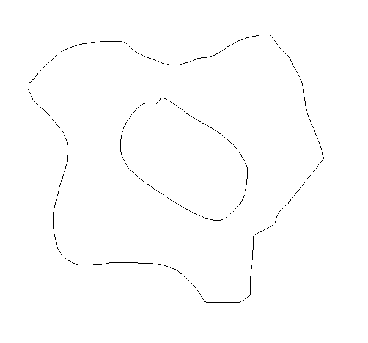

# Track Analysis Server

This server provides image analysis for my work-in-progress racing game, turning
bitmap images such as this:

into a series of bezier curves, which are interpreted by the game.

## Running the Server

Running this server requires golang.

`PORT=8080 FRONTEND_URL=http://myFrontendUrl.com go run server.go`
